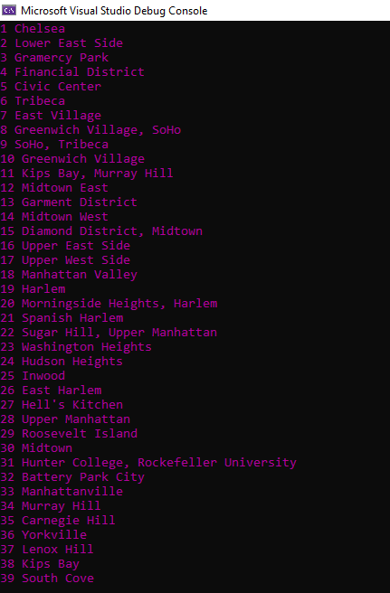

# Lab09-LINQ

## Description
A .NET console app that prints to the console the results of filtering down data from a JSON file using LINQ.
Employs both LINQ Method and Query syntax.

## Getting Started
Clone this repository to your local machine.

In a command line environment with Git installed:
```
https://github.com/sultan-kanaan/Lab09-LINQ.git
```


## Visuals

